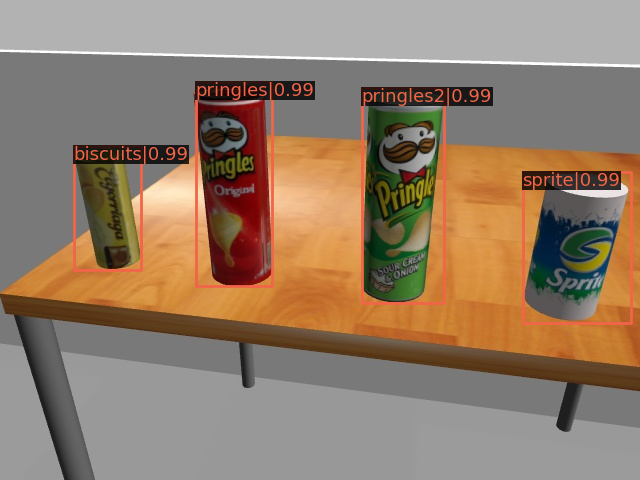

# mmdetection_ros
This is a ROS package for 2D object detection, which simply utilizes the toolbox [MMDetection](https://github.com/open-mmlab/mmdetection) of [OpenMMLab](https://openmmlab.com/).

### Requirements

- ROS Melodic
- Python 3.6+, PyTorch 1.3+, CUDA 9.2+ and [MMCV](https://mmcv.readthedocs.io/en/latest/#installation)

### Installation

0. Clone all needed packages: this package, mmdetection and vision_msgs

   ```shell
   cd {YOUR WORKSPACE}/src
   git clone https://github.com/afengisme11/mmdetection_ros.git
   git clone https://github.com/ros-perception/vision_msgs.git
   cd mmdetection_ros
   git clone https://github.com/open-mmlab/mmdetection.git
   ```

1. [MMDetection](https://github.com/open-mmlab/mmdetection) is a toolbox for 2D object detection. For using it I used a virtual environment in python3

   ```bash
   sudo apt-get install python-pip python-dev python-virtualenv
   virtualenv --system-site-packages --python=python3 ~/mmdet
   source ~/mmdet/bin/activate
   pip --version # check the pip version
   ```

2. In this created environment we install all the requirements. Note that the following instructions for mmdetection are almost the same to the official one [here](https://github.com/open-mmlab/mmdetection/blob/master/docs/get_started.md), so you may also firstly have a look there if you have problems.

   ```shell
   pip install mmdet
   ```

3. Then install PyTorch and torchvision following the official instructions [here](https://pytorch.org/) or for previous version [here](https://pytorch.org/get-started/previous-versions/), e.g., I use CUDA 10.2 and install PyTorch 1.7.1, so I run this command:

   ```shell
   pip install torch==1.7.1 torchvision==0.8.2 torchaudio==0.7.2
   ```

4. Install mmcv-full.

   ```shell
   pip install mmcv-full -f https://download.openmmlab.com/mmcv/dist/{cu_version}/{torch_version}/index.html
   ```

   Check the table [here](https://github.com/open-mmlab/mmcv#install-with-pip). Please replace `{cu_version}` and `{torch_version}` in the url to your desired one. For example, I use the following command:

   ```shell
   pip install mmcv-full -f https://download.openmmlab.com/mmcv/dist/cu102/torch1.7.0/index.html
   ```

5. Install build requirements and then install MMDetection.

   ```shell
   cd ./mmdetection
   pip install -r requirements/build.txt
   pip install -v -e .
   ```

6. Install rospkg.

   ```shell
   pip install rospkg
   ```

7. Put your model in the `scripts` folder, and modify the model path and config path in the `mmdetector.py`. The default one now is a Faster R-CNN I trained on my custom dataset to detect 5 products in the robot [TIAGo](http://wiki.ros.org/Robots/TIAGo%2B%2B) context. You can also get it [here](https://drive.google.com/file/d/1RA-WhR15764v3J86-mlgVLpT21f3ia5Y/view?usp=sharing) if you want

### ROS Interfaces

#### params

- `~publish_rate`: the debug image publish rate. default: 1hz
- `~is_service`: whether or not to use service instead of subscribe-publish
- `~visualization`: whether or not to show the debug image

#### topics

- `~debug_image`: publish the debug image
- `~objects`: publish the inference result, containing the information of detected objects
- `~image`: subscribe the input image. The default one is ''/xtion/rgb/image_raw' for TIAGo

### Example

If you are using the robot TIAGo, you could

```shell
source ~/mmdet/bin/activate # in the python3 virtual env
roslaunch mmdetection_ros mmdetector.launch
```

TIAGo will continously do the inference on the camera image and publish the detection results

